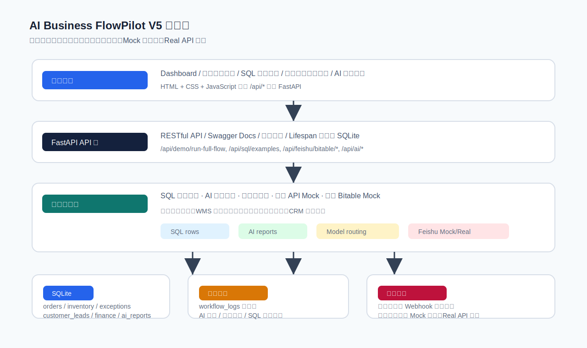
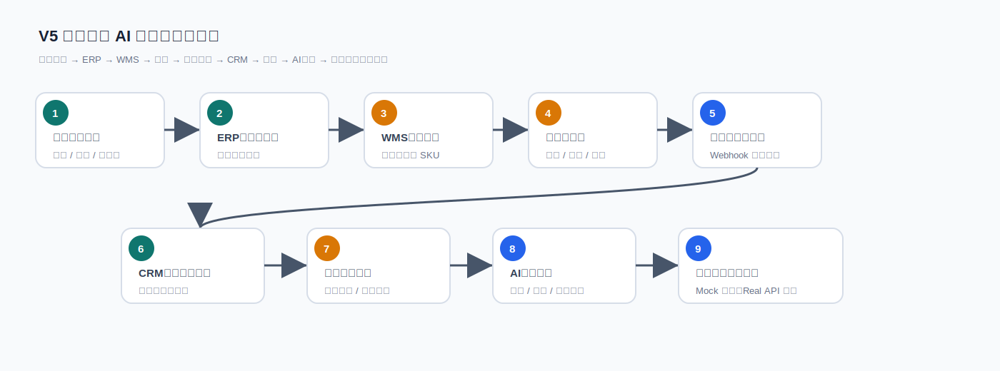
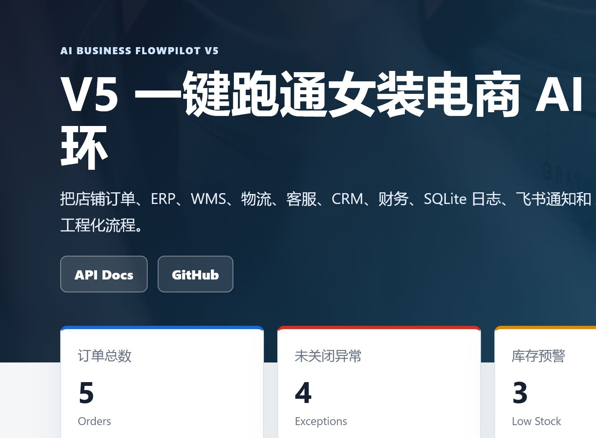
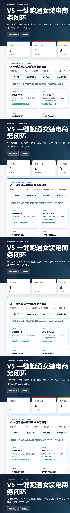
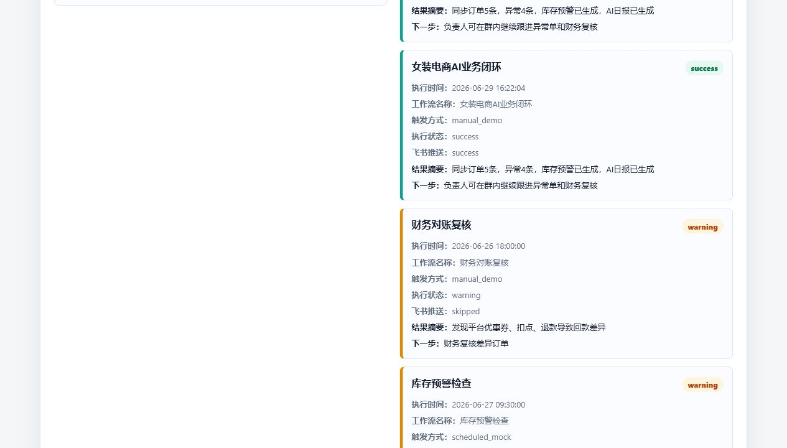
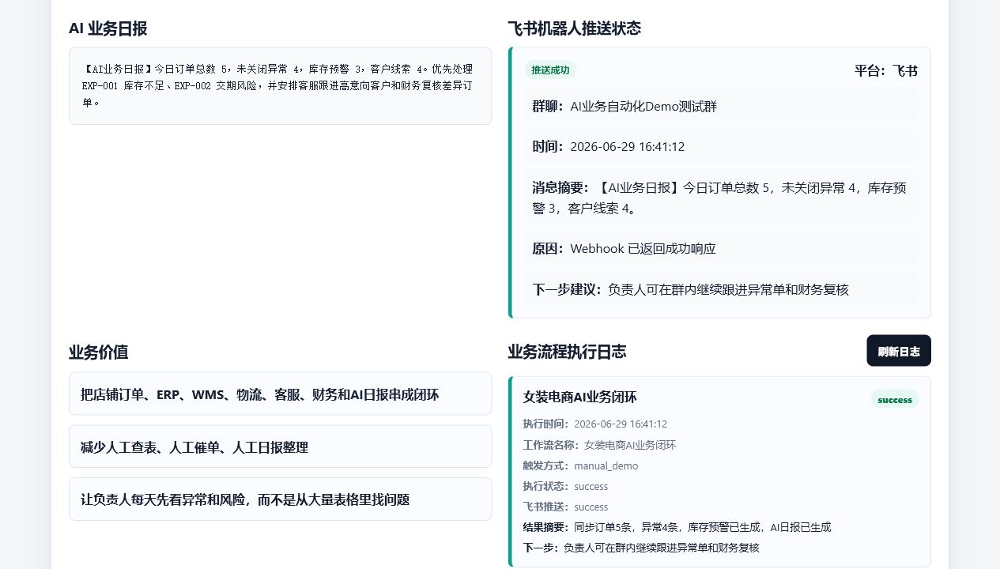
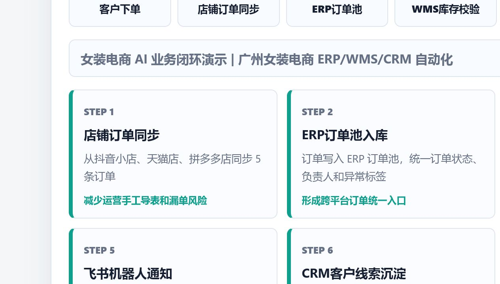
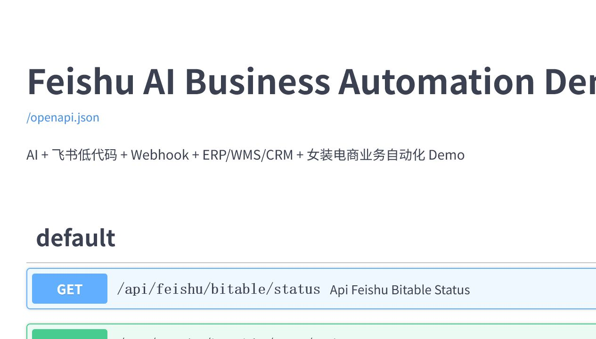

# AI Business FlowPilot | 飞书低代码供应链与客服自动化系统

> 面向「飞书低代码开发工程师（AI方向）」岗位的 GitHub 作品集 Demo。  
> 这是一个用于求职展示、面试讲解和本地演示的工程化 Demo，不是线上生产系统。

## 项目定位

AI Business FlowPilot 模拟广州女装电商企业在飞书低代码场景中的业务自动化升级：企业已经用飞书多维表格和自动化规则跑通 ERP / WMS / CRM 协作，现在希望逐步接入 AI、RESTful API、Webhook、SQL 分析、业务日志、飞书机器人通知和飞书多维表格同步。

项目重点不是“做一个静态页面”，而是把订单、库存、物流、客服、CRM、财务、AI 日报、飞书机器人和飞书多维表格 Mock 同步串成一条可点击演示的业务闭环。

## 业务场景

场景设定为广州女装电商：

- 抖音小店、天猫店、拼多多店产生女装订单。
- 店铺订单进入 ERP 订单池。
- WMS 校验广州仓、佛山仓库存。
- 库存不足、交期风险、物流延迟、财务差异进入异常处理。
- AI 生成异常分类、处理建议和业务日报。
- 飞书机器人展示 Webhook 推送状态。
- 飞书多维表格使用 Mock/Real 双模式设计，默认 Mock 演示数据同步，真实 API 预留配置入口。

## 核心能力

- FastAPI RESTful API
- SQLite 持久化
- SQL 查询真实结果
- `workflow_logs` 持久化
- 模拟 ERP / WMS / CRM / 物流 / 财务接口
- AI 异常分类与处理建议
- 多模型路由策略
- 飞书机器人 Webhook 状态展示
- 飞书多维表格 Mock/Real 双模式
- pytest 自动化测试
- GitHub Actions CI
- Dockerfile / Docker Compose 配置

## 技术栈

Python、FastAPI、SQLite、JavaScript、HTML/CSS、RESTful API、Webhook、pytest、GitHub Actions、Docker Compose。

## 系统架构图



架构说明：

1. 前端页面通过 `/api/*` 调用 FastAPI。
2. FastAPI API 层负责接口注册、参数校验、Swagger Docs 和启动时 SQLite 初始化。
3. 业务服务层包含 SQL 查询、AI 异常分类、多模型路由、外部 API Mock、飞书 Bitable Mock。
4. SQLite 保存订单、库存、异常、客户线索、财务对账、AI 日报和 workflow logs。
5. 飞书机器人 Webhook 和飞书多维表格 Real API 均通过环境变量预留，不提交真实密钥。

## 业务流程图



V5 一键流程包含 9 步：

1. 店铺订单同步
2. ERP订单池入库
3. WMS库存校验
4. 异常单生成
5. 飞书机器人通知
6. CRM客户线索沉淀
7. 财务回款对账
8. AI日报生成
9. 飞书多维表格同步

## 功能截图

以下截图来自当前 V5 本地页面，不再使用旧版 V4 展示图。

### 首页 Dashboard



### 一键跑通业务闭环



### SQL 查询结果



### 飞书多维表格 Mock 同步



### Workflow Logs



### FastAPI Docs



## 本地启动

```bash
python -m venv .venv

# Windows
.venv\Scripts\activate

pip install -r requirements.txt
uvicorn app.main:app --reload --host 0.0.0.0 --port 8000
```

打开：

```text
http://127.0.0.1:8000/
http://127.0.0.1:8000/docs
```

## 测试

```bash
python -m compileall app
python -m pytest -q
```

当前 V5.3 收口前本地验证结果：

```text
python -m compileall app: passed
python -m pytest -q: 7 passed
```

## Docker

```bash
docker compose up --build
```

项目已提供 `Dockerfile` 和 `docker-compose.yml`。如果当前机器未安装 Docker CLI，则无法本地执行 `docker compose config` 或 `docker compose up`，可在具备 Docker 的环境中继续验收。

## 核心 API 列表

| 方法 | 路径 | 说明 |
|---|---|---|
| `GET` | `/health` | 健康检查 |
| `GET` | `/api/dashboard` | 首页统计数据 |
| `GET` | `/api/sql/examples` | SQL 示例和 SQLite 查询结果 |
| `GET` | `/api/workflow/logs` | 最近业务流程执行日志 |
| `POST` | `/api/demo/run-full-flow` | 一键跑通 9 步女装电商 AI 业务闭环 |
| `POST` | `/api/ai/exception-classify` | AI 异常分类与处理建议 |
| `GET` | `/api/model-routing` | 多模型路由策略 |
| `POST` | `/api/model-routing/select` | 按任务选择模型 |
| `GET` | `/api/feishu/bitable/status` | 飞书多维表格 Mock/Real 配置状态 |
| `POST` | `/api/feishu/bitable/sync/all` | 一键模拟同步订单、库存、异常、线索和 AI 日报 |

## 飞书多维表格说明

当前项目默认使用 Mock 模式：

```text
FEISHU_ENABLE_REAL_API=false
```

这不是伪装成真实生产接入，而是为了在没有企业飞书开放平台密钥的情况下，完整演示业务数据如何同步到飞书多维表格。Mock 模式适合本地开发、面试演示和接口联调。

真实 Real 模式需要：

- 飞书开放平台 App ID
- App Secret
- App Token
- 多维表格 Table ID
- 对应应用权限和租户授权

真实密钥必须放在本地 `.env`，不能提交到 GitHub。项目已在 `.env.example` 中预留配置项：

```text
FEISHU_ENABLE_REAL_API=false
FEISHU_WEBHOOK_URL=
FEISHU_APP_ID=
FEISHU_APP_SECRET=
FEISHU_APP_TOKEN=
FEISHU_TABLE_ORDERS=
FEISHU_TABLE_INVENTORY=
FEISHU_TABLE_EXCEPTIONS=
FEISHU_TABLE_LEADS=
FEISHU_TABLE_REPORTS=
DATABASE_URL=sqlite:///data/app.db
```

如果 `FEISHU_ENABLE_REAL_API=true` 但配置不完整，系统会自动降级到 Mock 模式并返回缺失配置项。

## 项目结构

```text
feishu-ai-business-automation-demo/
├── app/
│   ├── main.py
│   ├── db.py
│   ├── v3_api.py
│   ├── services/
│   └── static/
├── assets/
│   ├── architecture-v5.svg
│   ├── business-flow-v5.svg
│   └── v5-*.png
├── data/
├── docs/
├── sql/init.sql
├── tests/
├── .github/workflows/ci.yml
├── Dockerfile
├── docker-compose.yml
├── requirements.txt
└── README.md
```

## 2 分钟项目讲解稿

这个项目我选择广州女装电商作为业务场景，是因为这个岗位不仅需要会写接口，还需要理解飞书低代码如何服务真实业务协作。女装电商里订单、库存、物流、客服、客户线索和财务对账天然分散在不同系统里，很适合展示 ERP / WMS / CRM / 财务数据流如何被自动化串起来。

我用 FastAPI 提供 RESTful API，用 SQLite 做本地持久化，把订单、库存、异常、客户线索、财务差异、AI 日报和 workflow logs 都落到数据库里。SQL 模块不是只展示语句，而是返回真实查询结果，比如未关闭异常订单、低库存 SKU、高意向客户线索和财务对账差异。

AI 部分目前采用本地规则模拟异常分类和多模型路由，返回异常类型、严重等级、责任部门、建议动作和模型选择原因。这样即使没有真实 API Key，也能完整展示 AI 接入业务流程的设计方式。

飞书部分我做了两层：飞书机器人 Webhook 用于展示日报和异常摘要推送状态；飞书多维表格采用 Mock/Real 双模式，默认 Mock 方便面试演示，Real 模式预留 App ID、Secret、App Token 和 Table ID。这样既保护密钥，又能说明未来如何把 SQLite 业务数据同步到飞书低代码表格里，形成运营、客服、供应链和财务都能协作的闭环。
