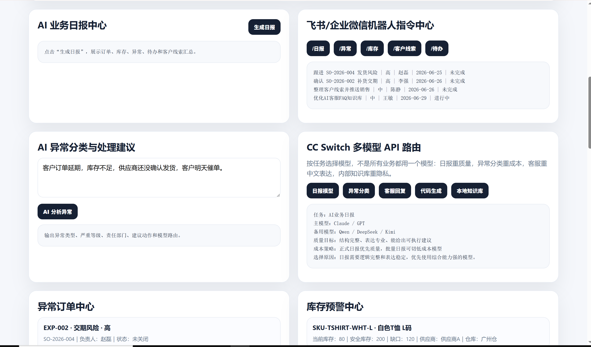
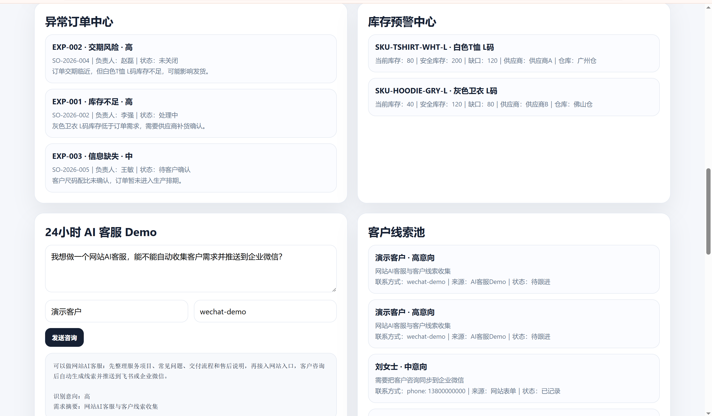
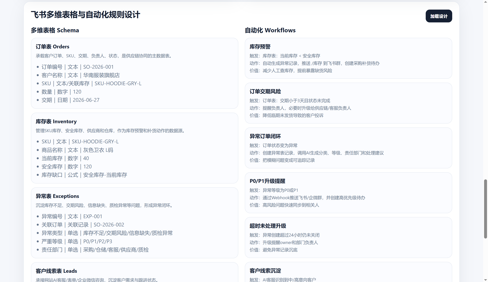

# AI Business FlowPilot | 飞书低代码供应链与客服自动化系统

> AI + 飞书低代码 + Webhook + CC Switch 多模型 API 路由 + AI 客服 + ERP/WMS/CRM + 女装电商供应链自动化作品集项目

这个项目不是线上生产系统，而是用于**求职展示、面试演示和 GitHub 作品集沉淀**的 AI 低代码业务自动化 Demo。项目模拟广州女装电商已经用飞书低代码跑通 ERP / WMS / CRM 后，继续接入 AI、云函数、审批流、物流/店铺/财务 API、RAG 和预测模型的升级路线。

## V3 升级说明

V3 把原有「飞书多维表格 + Webhook Demo」升级为更贴近**飞书低代码开发工程师（AI方向）**岗位的作品集项目。

保留原有能力：

- FastAPI 项目结构
- 首页 Dashboard
- AI 日报模块
- 异常分类模块
- CC Switch / 多模型 API 路由说明
- 飞书 Webhook 测试接口
- README 截图展示

新增能力：

- 女装电商 ERP/WMS/CRM 业务闭环
- 店铺、WMS、物流、财务、CRM 模拟 API
- MySQL schema、SQL 示例和 Docker Compose
- 飞书审批流、飞书云函数迁移设计
- AI/RAG/预测模型路线
- Linux / Docker / Nginx / systemd 部署说明

## 项目截图

### 业务驾驶舱


### AI日报、机器人指令、异常分类与多模型路由



### 异常订单、库存预警、AI客服与客户线索



### 飞书多维表格 Schema 与自动化规则



### FastAPI 接口文档


## 女装电商业务闭环

```text
客户下单 -> 店铺订单同步 -> ERP订单池 -> WMS库存校验 -> 发货/物流跟踪 -> 客服售后 -> 财务回款 -> AI日报/异常预警
```

## V4：一键跑通女装电商 AI 业务闭环

V4 把项目从“页面展示型 Demo”升级为“可点击演示的业务流程型 Demo”。首页新增 **一键跑通业务闭环** 按钮，点击后调用：

```text
POST /api/demo/run-full-flow
```

完整业务链路：

```text
店铺订单 -> ERP订单池 -> WMS库存校验 -> 异常单生成 -> 飞书通知 -> CRM线索沉淀 -> 财务回款对账 -> AI日报
```

一键演示会返回 8 个流程步骤卡片、AI 业务日报、飞书推送状态和业务价值说明。若 `FEISHU_WEBHOOK_URL` 未配置，流程不会报错，会显示：

```text
skipped: FEISHU_WEBHOOK_URL is empty
```

新增接口：

- `POST /api/demo/run-full-flow`：运行完整女装电商 AI 业务闭环。
- `GET /api/workflow/logs`：查看最近 workflow 执行记录。

V4 对应岗位能力：

- 飞书低代码：把订单、异常、审批、任务和机器人通知串成业务闭环。
- Python RESTful API：用 FastAPI 提供可演示、可调试、可扩展接口。
- Webhook：AI 日报和异常摘要可推送到飞书群。
- SQL：用订单、库存、异常、线索、财务表支撑日报和风控分析。
- ERP/WMS/CRM业务理解：覆盖订单池、库存校验、客户线索、财务对账。
- AI/LLM接入：生成业务日报、异常摘要和处理建议。
- RAG和预测模型路线：客服知识库、售后知识库、库存预测、爆款SKU预测。
- Linux/Docker部署意识：保留 Docker Compose、Nginx、systemd、日志排查文档。

面试讲解话术：

> 我不是只做了一个页面，而是把女装电商中的订单、库存、异常、客户线索、财务对账和日报串成了一个可演示的自动化闭环。面试现场可以点击“一键跑通业务闭环”，看到从店铺订单同步到 AI 日报生成、飞书推送状态和 workflow 日志的完整链路。

这个闭环对应真实电商组织中的角色协同：

- 店铺运营：抖音小店、天猫店、拼多多店订单同步。
- ERP：统一订单池、订单状态、异常标签和负责人。
- WMS：广州仓、佛山仓库存校验和低库存预警。
- 物流：物流延迟、退换货、少发漏发识别。
- 客服 / CRM：售后处理、客户线索沉淀、高意向客户跟进。
- 财务：订单金额、已回款金额、差异原因和复核审批。
- AI：日报摘要、异常分类、RAG 客服、预测模型和多模型路由。

## V3 模拟 API 清单

| 方法 | 路径 | 说明 |
|---|---|---|
| `GET` | `/api/ecommerce/flow` | 返回女装电商业务闭环。 |
| `GET` | `/api/mock/shop/orders` | 返回抖音小店、天猫店、拼多多店模拟订单。 |
| `POST` | `/api/mock/shop/orders/sync` | 模拟店铺订单同步到 ERP 订单池。 |
| `POST` | `/api/mock/wms/inventory/check` | 模拟 WMS 库存校验和低库存预警。 |
| `POST` | `/api/mock/logistics/track` | 模拟物流轨迹查询和异常识别。 |
| `POST` | `/api/mock/finance/reconcile` | 模拟财务对账和回款差异分析。 |
| `POST` | `/api/mock/crm/leads` | 模拟 CRM 客户线索沉淀。 |
| `GET` | `/api/sql/examples` | 返回 ERP/WMS/CRM/财务相关 SQL 示例。 |
| `GET` | `/api/ai/roadmap` | 返回 AI/RAG/预测模型路线。 |
| `GET` | `/api/deployment/checklist` | 返回 Linux/Docker 部署清单。 |

## MySQL / SQL 能力

V3 新增 `sql/init.sql`，包含 8 张表并插入 demo 数据：

- `orders`
- `inventory`
- `exceptions`
- `customer_leads`
- `ai_reports`
- `workflow_logs`
- `finance_reconcile`
- `logistics_tracking`

这些表支撑 ERP 订单池、WMS 库存、CRM 线索、飞书审批流、物流跟踪、财务对账和 AI 日报。说明文档见 [`docs/MYSQL_SCHEMA.md`](docs/MYSQL_SCHEMA.md)。

## 飞书审批流和云函数设计

- [`docs/ECOMMERCE_BUSINESS_FLOW.md`](docs/ECOMMERCE_BUSINESS_FLOW.md)：女装电商业务闭环。
- [`docs/ERP_WMS_CRM_API_DESIGN.md`](docs/ERP_WMS_CRM_API_DESIGN.md)：模拟店铺、WMS、物流、财务、CRM API。
- [`docs/FEISHU_APPROVAL_WORKFLOW.md`](docs/FEISHU_APPROVAL_WORKFLOW.md)：库存不足、交期风险、高意向客户、财务差异审批流。
- [`docs/FEISHU_CLOUD_FUNCTIONS.md`](docs/FEISHU_CLOUD_FUNCTIONS.md)：订单同步、库存预警、物流异常、AI日报、Webhook 通知函数。

## AI / RAG / 预测模型路线

见 [`docs/AI_ROADMAP_RAG_PREDICTION.md`](docs/AI_ROADMAP_RAG_PREDICTION.md)：

- 客服知识库 RAG
- 商品知识库
- 售后规则库
- 库存缺货预测
- 爆款 SKU 预测
- 财务异常识别
- 多模型路由

## Linux / Docker 部署能力

V3 新增 `docker-compose.yml`：

- `app` 服务：FastAPI Demo。
- `mysql` 服务：MySQL 8.4。
- 端口映射：`8000:8000`。
- MySQL 初始化：挂载 `sql/init.sql`。
- 环境变量示例：Webhook、OpenAI-Compatible API、MySQL 配置。

部署说明见 [`docs/LINUX_DEPLOYMENT.md`](docs/LINUX_DEPLOYMENT.md)。

## 快速启动

```bash
python -m venv .venv

# Windows
.venv\Scripts\activate

# macOS / Linux
source .venv/bin/activate

pip install -r requirements.txt
uvicorn app.main:app --reload --host 0.0.0.0 --port 8000
```

打开：

```text
http://127.0.0.1:8000/
http://127.0.0.1:8000/docs
```

## Docker Compose

```bash
docker compose up -d --build
docker compose logs -f app
```

## 环境变量

```text
DATABASE_PATH=./business_demo.db
FEISHU_WEBHOOK_URL=
WECHAT_WORK_WEBHOOK_URL=
OPENAI_API_KEY=
OPENAI_BASE_URL=https://api.openai.com/v1
OPENAI_MODEL=gpt-4o-mini
MYSQL_HOST=mysql
MYSQL_DATABASE=flowpilot
MYSQL_USER=flowpilot
MYSQL_PASSWORD=flowpilot_demo
```

## 面试讲解话术

> 这个项目模拟广州女装电商从飞书低代码 ERP/WMS/CRM 出发，逐步接入 AI 的过程。我先把订单、库存、物流、售后、财务和客户线索抽象成数据表和 API，再用飞书审批流承接异常闭环，用 Webhook 做通知，用 SQL 支撑日报分析，最后设计 RAG 和预测模型路线。它不是生产系统，而是一个能在面试现场跑通、能解释业务价值、也能展示工程实现能力的作品集 Demo。

演示路径：

1. 打开首页 Dashboard，看订单、异常、库存、待办和线索指标。
2. 演示「女装电商业务闭环」和「模拟外部 API 对接中心」。
3. 点击同步店铺订单、WMS库存校验、物流轨迹查询、财务对账、CRM线索沉淀。
4. 展示 SQL 示例和 `sql/init.sql`，说明自己能写查询、能理解业务数据模型。
5. 展示 AI 日报、异常分类和 CC Switch 多模型路由。
6. 打开飞书审批流、云函数、Linux 部署、AI/RAG 路线文档，说明后续如何落地到真实飞书环境。

## 项目结构

```text
feishu-ai-business-automation-demo/
├── app/
│   ├── main.py
│   ├── db.py
│   ├── services/
│   └── static/
├── data/
├── docs/
├── sql/init.sql
├── tests/
├── Dockerfile
├── docker-compose.yml
├── requirements.txt
└── README.md
```
