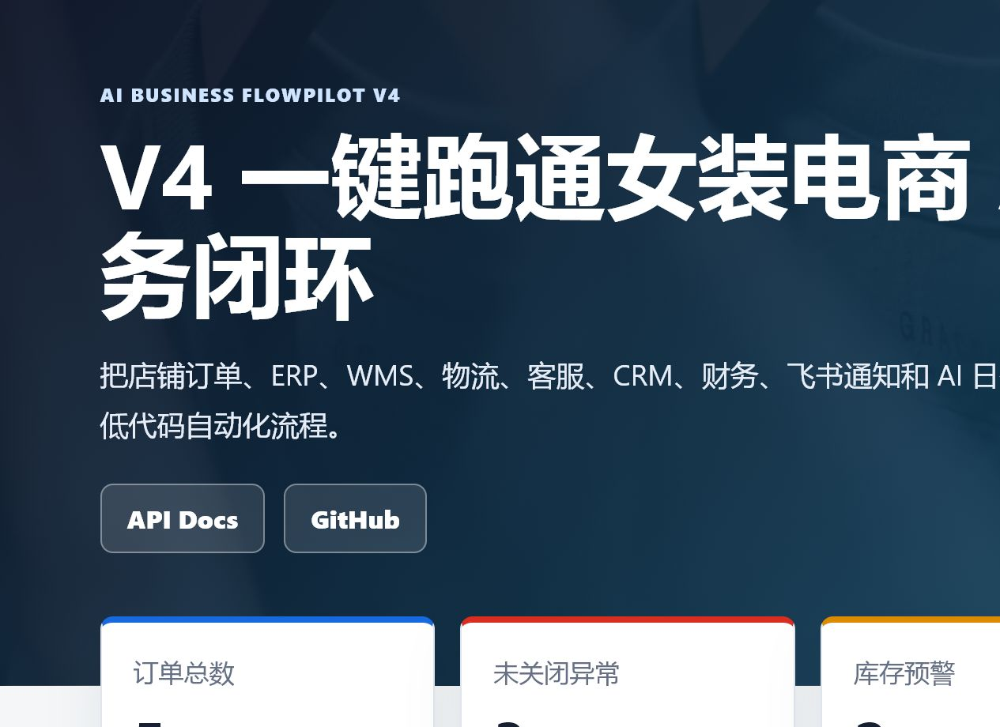
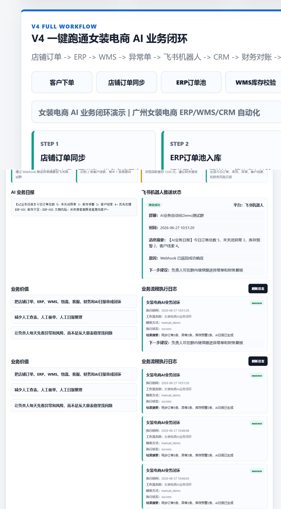
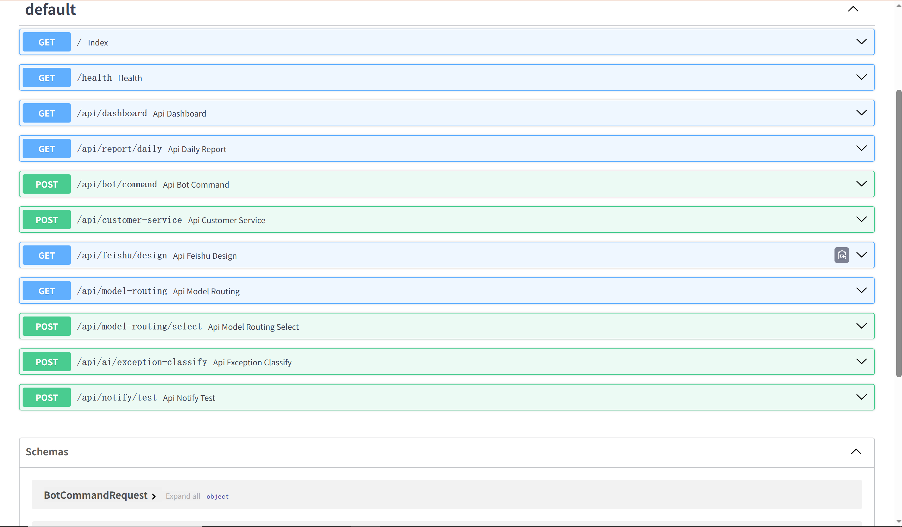
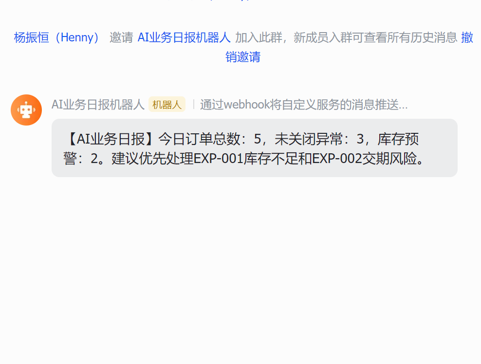
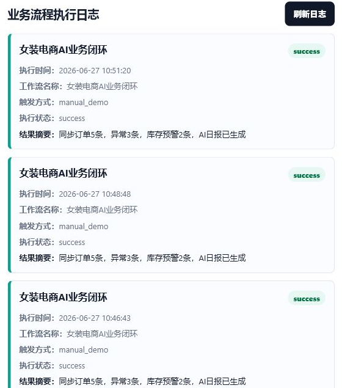

# AI Business FlowPilot | 飞书低代码供应链与客服自动化系统

> 面向女装电商场景的 AI 低代码业务自动化作品集 Demo。  
> 这个项目不是线上生产系统，而是用于求职展示、面试演示和 GitHub 作品集沉淀。

## 项目定位

AI Business FlowPilot 模拟一家广州女装电商企业：业务已经通过飞书低代码跑通 ERP / WMS / CRM，现在需要逐步接入 AI、Webhook、云函数、审批流、物流/店铺/财务 API、SQL 分析、RAG 和预测模型。

项目把订单、ERP、WMS、物流、客服、CRM、财务、飞书通知和 AI 日报串成一条可点击演示的业务闭环。面试时可以直接在首页点击“一键跑通业务闭环”，展示从店铺订单同步到 AI 日报生成、飞书机器人推送状态和流程日志的完整链路。

## V5 作品集截图

### 首页截图



### 一键跑通截图



### API Docs 截图



### 飞书机器人推送截图

> 机器人推送验证截图：用于证明 Webhook 推送链路已经在飞书测试群验证过。



### 工作流日志截图



## 核心能力

1. 飞书低代码多维表格设计：订单、库存、异常、客户线索、财务对账和 workflow 日志。
2. Python FastAPI / RESTful API：提供 Dashboard、AI 日报、异常分类、外部 API 模拟和 V5 一键流程接口。
3. Webhook / 飞书机器人推送：AI 日报和异常摘要可推送到飞书测试群。
4. 模拟外部 API 对接：店铺订单、WMS、物流、财务、CRM。
5. SQLite / SQL 查询与业务分析：支持异常订单、低库存 SKU、每日订单异常统计、高意向线索、财务差异查询。
6. AI 日报与异常分类：把订单、库存、客户线索、财务风险转成结构化摘要和处理建议。
7. 客户线索沉淀：AI 客服识别客户需求、意向等级和跟进状态。
8. 多模型路由：按日报、异常分类、客服回复、代码生成、私域知识库选择不同模型策略。
9. AI/RAG/预测模型路线设计：客服 RAG、售后知识库、库存缺货预测、爆款 SKU 预测、财务异常识别。
10. 一键跑通业务流程 Demo：点击按钮即可展示完整女装电商自动化闭环。

## 飞书多维表格接入设计

当前项目默认使用 **Mock 模式**，方便在没有企业飞书开放平台密钥的情况下，完整演示订单、库存、异常、客户线索和 AI 日报同步到飞书多维表格的业务流程。Mock 模式不是伪造生产接入，而是用于本地开发、面试演示和接口联调。

项目已经预留 Real 模式配置项：

```text
FEISHU_ENABLE_REAL_API=false
FEISHU_APP_ID=
FEISHU_APP_SECRET=
FEISHU_APP_TOKEN=
FEISHU_TABLE_ORDERS=
FEISHU_TABLE_INVENTORY=
FEISHU_TABLE_EXCEPTIONS=
FEISHU_TABLE_LEADS=
FEISHU_TABLE_REPORTS=
```

真实密钥必须放在 `.env`，不能提交到 GitHub。默认 `FEISHU_ENABLE_REAL_API=false`，如果设置为 `true` 但配置不完整，系统会自动降级到 Mock 模式并返回缺失配置项。

面试讲解重点：

- 为什么设计 real/mock 双模式：没有企业密钥时仍能完整演示流程，有真实环境后可平滑扩展。
- 为什么使用环境变量保护密钥：避免 App Secret、App Token、Webhook 泄漏到 GitHub。
- 如何把 SQLite 业务数据同步到飞书多维表格：后端从 SQLite 读取 orders、inventory、exceptions、customer_leads、ai_reports，再调用 `FeishuBitableClient`。
- 如何和飞书机器人 Webhook、AI 日报、异常工单形成业务闭环：一键流程会先生成 AI 日报和异常摘要，再模拟同步到飞书多维表格，保留后续真实 API 接入边界。

## V5：一键跑通女装电商 AI 业务闭环

首页核心演示模块：

```text
店铺订单 -> ERP -> WMS -> 异常单 -> 飞书机器人 -> CRM -> 财务对账 -> AI日报
```

调用接口：

```text
POST /api/demo/run-full-flow
```

返回并展示：

- 8 个流程步骤卡片
- AI 业务日报
- 飞书机器人推送状态
- 业务价值卡片
- 业务流程执行日志，写入 SQLite `workflow_logs`，刷新后仍可查看
- SQL 查询示例和真实 SQLite 查询结果表格

面试讲解话术：

> 我不是只做了一个页面，而是把女装电商中的订单、库存、异常、客户线索、财务对账和日报串成了一个可演示的自动化闭环。

## 主要 API

| 方法 | 路径 | 说明 |
|---|---|---|
| `POST` | `/api/demo/run-full-flow` | 一键跑通女装电商 AI 业务闭环。 |
| `GET` | `/api/workflow/logs` | 查看最近业务流程执行日志。 |
| `GET` | `/api/ecommerce/flow` | 返回女装电商业务闭环。 |
| `GET` | `/api/mock/shop/orders` | 返回抖音小店、天猫店、拼多多店模拟订单。 |
| `POST` | `/api/mock/shop/orders/sync` | 模拟店铺订单同步到 ERP 订单池。 |
| `POST` | `/api/mock/wms/inventory/check` | 模拟 WMS 库存校验和低库存预警。 |
| `POST` | `/api/mock/logistics/track` | 模拟物流轨迹查询和异常识别。 |
| `POST` | `/api/mock/finance/reconcile` | 模拟财务对账和回款差异分析。 |
| `POST` | `/api/mock/crm/leads` | 模拟 CRM 客户线索沉淀。 |
| `GET` | `/api/sql/examples` | 返回 ERP/WMS/CRM/财务相关 SQL 示例。 |
| `GET` | `/api/ai/roadmap` | 返回 AI/RAG/预测模型路线。 |
| `GET` | `/api/feishu/bitable/status` | 查看飞书多维表格 mock/real 配置状态。 |
| `POST` | `/api/feishu/bitable/sync/orders` | 模拟同步订单到飞书多维表格。 |
| `POST` | `/api/feishu/bitable/sync/inventory` | 模拟同步库存到飞书多维表格。 |
| `POST` | `/api/feishu/bitable/sync/exceptions` | 模拟同步异常到飞书多维表格。 |
| `POST` | `/api/feishu/bitable/sync/leads` | 模拟同步客户线索到飞书多维表格。 |
| `POST` | `/api/feishu/bitable/sync/report` | 模拟同步 AI 日报到飞书多维表格。 |
| `POST` | `/api/feishu/bitable/sync/all` | 一键模拟同步订单、库存、异常、线索和日报。 |

## SQL 与数据模型

`sql/init.sql` 包含 8 张 demo 表：

- `orders`
- `inventory`
- `exceptions`
- `customer_leads`
- `ai_reports`
- `workflow_logs`
- `finance_reconcile`
- `logistics_tracking`

这些表支撑 ERP 订单池、WMS 库存、CRM 线索、飞书审批流、物流跟踪、财务对账和 AI 日报。说明文档见 [`docs/MYSQL_SCHEMA.md`](docs/MYSQL_SCHEMA.md)。

## 飞书审批流和云函数设计

- [`docs/ECOMMERCE_BUSINESS_FLOW.md`](docs/ECOMMERCE_BUSINESS_FLOW.md)：女装电商业务闭环。
- [`docs/ERP_WMS_CRM_API_DESIGN.md`](docs/ERP_WMS_CRM_API_DESIGN.md)：模拟店铺、WMS、物流、财务、CRM API。
- [`docs/FEISHU_APPROVAL_WORKFLOW.md`](docs/FEISHU_APPROVAL_WORKFLOW.md)：库存不足、交期风险、高意向客户、财务差异审批流。
- [`docs/FEISHU_CLOUD_FUNCTIONS.md`](docs/FEISHU_CLOUD_FUNCTIONS.md)：订单同步、库存预警、物流异常、AI日报、Webhook 通知函数。

## AI / RAG / 预测模型路线

见 [`docs/AI_ROADMAP_RAG_PREDICTION.md`](docs/AI_ROADMAP_RAG_PREDICTION.md)：

- 客服知识库 RAG
- 商品知识库
- 售后规则库
- 库存缺货预测
- 爆款 SKU 预测
- 财务异常识别
- 多模型路由

## Linux / Docker 部署意识

项目保留 `docker-compose.yml` 和部署文档，覆盖：

- Ubuntu 环境
- Python venv
- `.env`
- Docker Compose
- Nginx 反向代理
- systemd 常驻运行
- 日志排查
- Webhook 安全配置

部署说明见 [`docs/LINUX_DEPLOYMENT.md`](docs/LINUX_DEPLOYMENT.md)。

## 快速启动

```bash
python -m venv .venv

# Windows
.venv\Scripts\activate

# macOS / Linux
source .venv/bin/activate

pip install -r requirements.txt
uvicorn app.main:app --reload --host 0.0.0.0 --port 8000
```

打开：

```text
http://127.0.0.1:8000/
http://127.0.0.1:8000/docs
```

## Docker Compose

```bash
docker compose up -d --build
docker compose logs -f app
```

## 环境变量

```text
DATABASE_PATH=./business_demo.db
DATABASE_URL=sqlite:///data/app.db
FEISHU_ENABLE_REAL_API=false
FEISHU_WEBHOOK_URL=
FEISHU_APP_ID=
FEISHU_APP_SECRET=
FEISHU_APP_TOKEN=
FEISHU_TABLE_ORDERS=
FEISHU_TABLE_INVENTORY=
FEISHU_TABLE_EXCEPTIONS=
FEISHU_TABLE_LEADS=
FEISHU_TABLE_REPORTS=
WECHAT_WORK_WEBHOOK_URL=
OPENAI_API_KEY=
OPENAI_BASE_URL=https://api.openai.com/v1
OPENAI_MODEL=gpt-4o-mini
MYSQL_HOST=mysql
MYSQL_DATABASE=flowpilot
MYSQL_USER=flowpilot
MYSQL_PASSWORD=flowpilot_demo
```

## 项目结构

```text
feishu-ai-business-automation-demo/
├── app/
│   ├── main.py
│   ├── db.py
│   ├── services/
│   └── static/
├── assets/
├── data/
├── docs/
├── sql/init.sql
├── tests/
├── Dockerfile
├── docker-compose.yml
├── requirements.txt
└── README.md
```
